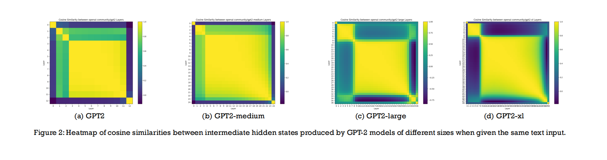
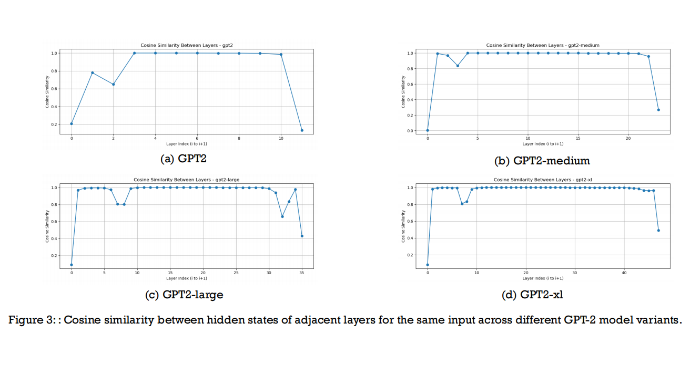

**Figure 1**: Visualization of intermediate layer outputs using LogitLens for the input “I want” in BC, HT, and ZT models.  

**Figure 2**: Heatmap of cosine similarities between intermediate hidden states produced by GPT-2 models of different sizes when given the same text input.  

**Figure 2**: : Cosine similarity between hidden states of adjacent layers for the same input across different GPT-2 model variants.  

